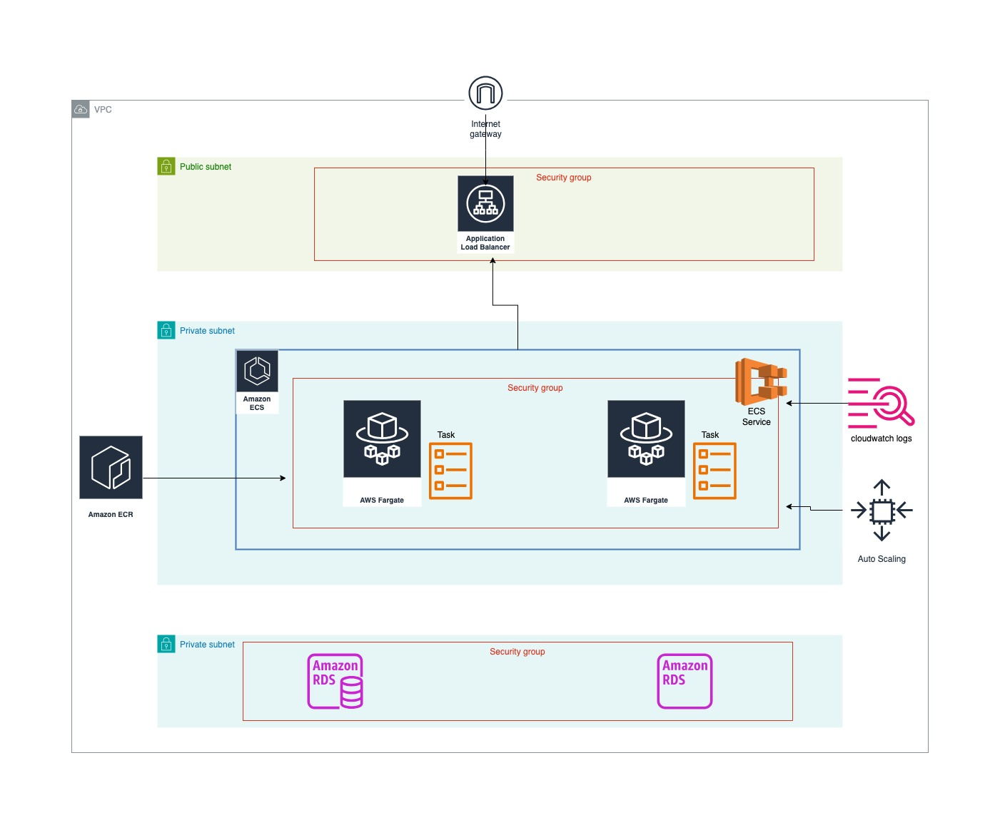

# Employee Management Platform
Production-ready full-stack application demonstrating modern DevOps practices, Infrastructure as Code, and automated deployment on AWS.

This project showcases how to provision cloud infrastructure with Terraform, containerize a Java Spring Boot backend and React frontend, automate deployments with GitHub Actions, and operate the application on Amazon ECS Fargate using production-inspired infrastructure patterns.

> **Purpose**
>
> This repository demonstrates an end-to-end DevOps workflow from infrastructure provisioning to application deployment using automation, Infrastructure as Code, and cloud-native services.

# Architecture

The platform is deployed on AWS using a highly available architecture consisting of:

* Amazon ECS Fargate
* Application Load Balancer
* Amazon RDS
* Amazon ECR
* Amazon S3
* Amazon CloudTrail
* Amazon CloudWatch
* AWS Certificate Manager (ACM)
* Amazon Route 53
* Terraform
* GitHub Actions

# Project Goals

This project demonstrates how to:

* Provision cloud infrastructure using Terraform.
* Build and containerize application services.
* Automate deployments through GitHub Actions.
* Deploy workloads on Amazon ECS Fargate.
* Secure networking using VPCs, subnets, and Security Groups.
* Configure HTTPS with AWS Certificate Manager.
* Enable infrastructure auditing and monitoring.
* Implement scalable cloud architecture.

# Technology Stack

| Category       | Technologies       |
| -------------- | ------------------ |
| Frontend       | React              |
| Backend        | Spring Boot (Java) |
| Containers     | Docker             |
| Infrastructure | Terraform          |
| Cloud          | AWS                |
| Orchestration  | Amazon ECS Fargate |
| Database       | Amazon RDS         |
| Registry       | Amazon ECR         |
| CI/CD          | GitHub Actions     |
| Networking     | VPC, ALB, Route 53 |
| Monitoring     | Amazon CloudWatch  |
| Auditing       | AWS CloudTrail     |

# Deployment Workflow

1. Provision AWS infrastructure using Terraform.
2. Build the backend and frontend applications.
3. Build Docker container images.
4. Push container images to Amazon ECR.
5. Deploy updated services to Amazon ECS Fargate.
6. Route external traffic through the Application Load Balancer.
7. Monitor infrastructure and application health using CloudWatch.

# Infrastructure Highlights

* Infrastructure as Code using Terraform
* Containerized Java and React applications
* Automated CI/CD pipeline
* Application Load Balancer
* Amazon ECS Fargate
* Amazon RDS
* HTTPS using ACM
* Secure VPC networking
* CloudTrail auditing
* CloudWatch monitoring
* Modular Terraform configuration
* Automatic infrastructure provisioning

# Engineering Decisions

Several design decisions were made to keep the platform production-oriented while remaining simple to deploy.

### Why Amazon ECS Fargate?

ECS Fargate eliminates the operational overhead of managing EC2 instances while providing a managed environment for running containers.

### Why Terraform?

Terraform provides repeatable, version-controlled infrastructure provisioning that can be deployed consistently across environments.

### Why GitHub Actions?

GitHub Actions enables automated build, test, and deployment workflows directly from the source repository.

### Why Amazon RDS?

Amazon RDS provides a managed relational database service with automated backups and operational simplicity.

# Security Considerations

The platform incorporates several production-inspired security practices, including:

* Private subnets for application workloads
* Security Groups controlling network access
* HTTPS using ACM certificates
* IAM-based access control
* Infrastructure auditing with CloudTrail
* Containerized application deployment

# Getting Started

Deployment instructions and infrastructure documentation will be available under the `docs/` directory.
